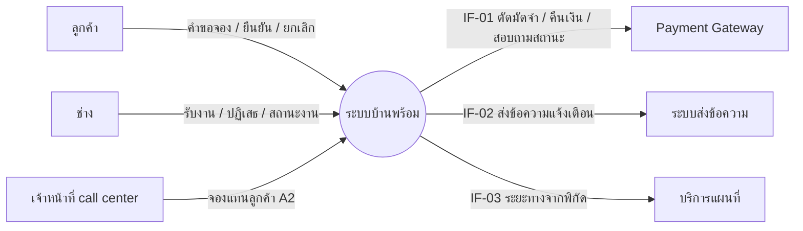
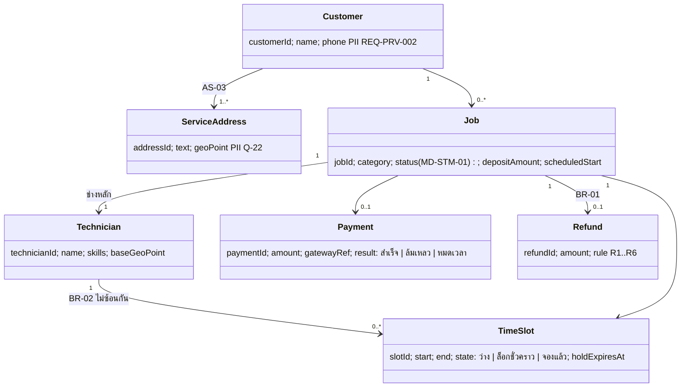
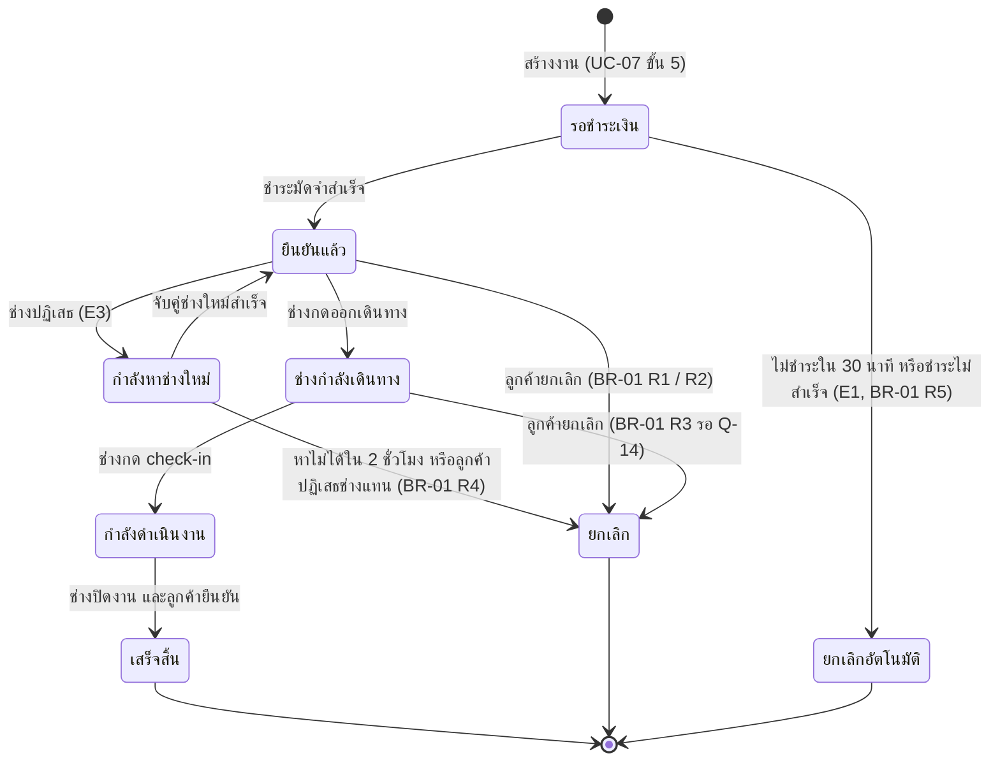
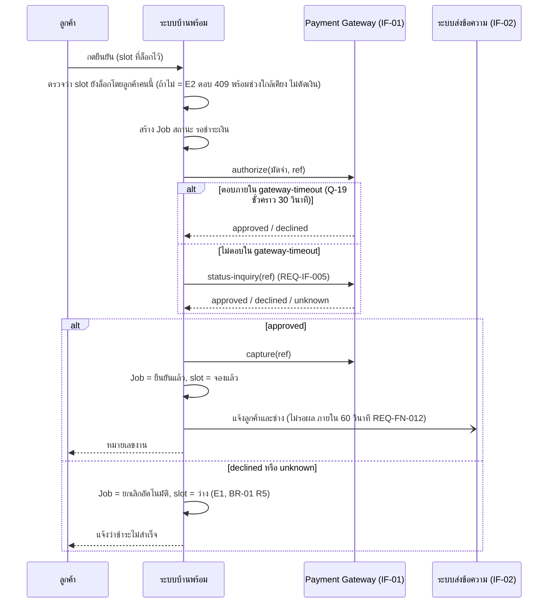

# โมเดลที่ UC-07 ใช้ (MD-CTX-01, MD-DOM-01, MD-STM-01, MD-SEQ-07-05)

เวอร์ชัน 1.0 เข้า Baseline B1 | เขียนด้วย Mermaid เปิดดูภาพได้บน GitHub
ภาพต้นฉบับขนาดเต็มอยู่ในบทเรียน Integrated Requirements Modelling

## MD-CTX-01 Context Diagram (เฉพาะส่วนที่ UC-07 แตะ)

## MD-DOM-01 Domain Model (conceptual)

## MD-STM-01 วงจรชีวิตของงาน (8 สถานะ ตาม REQ-DAT-002 ที่แก้ CC-01 แล้ว)

สถานะ "กำลังดำเนินงาน" และ "เสร็จสิ้น" ยกเลิกไม่ได้ (BR-01 R6) จึงไม่มี transition "ยกเลิก" ออกจากสองสถานะนี้

## MD-SEQ-07-05 ลำดับการชำระมัดจำ (UC-07 ขั้น 5 รวม E1 และ E2)

